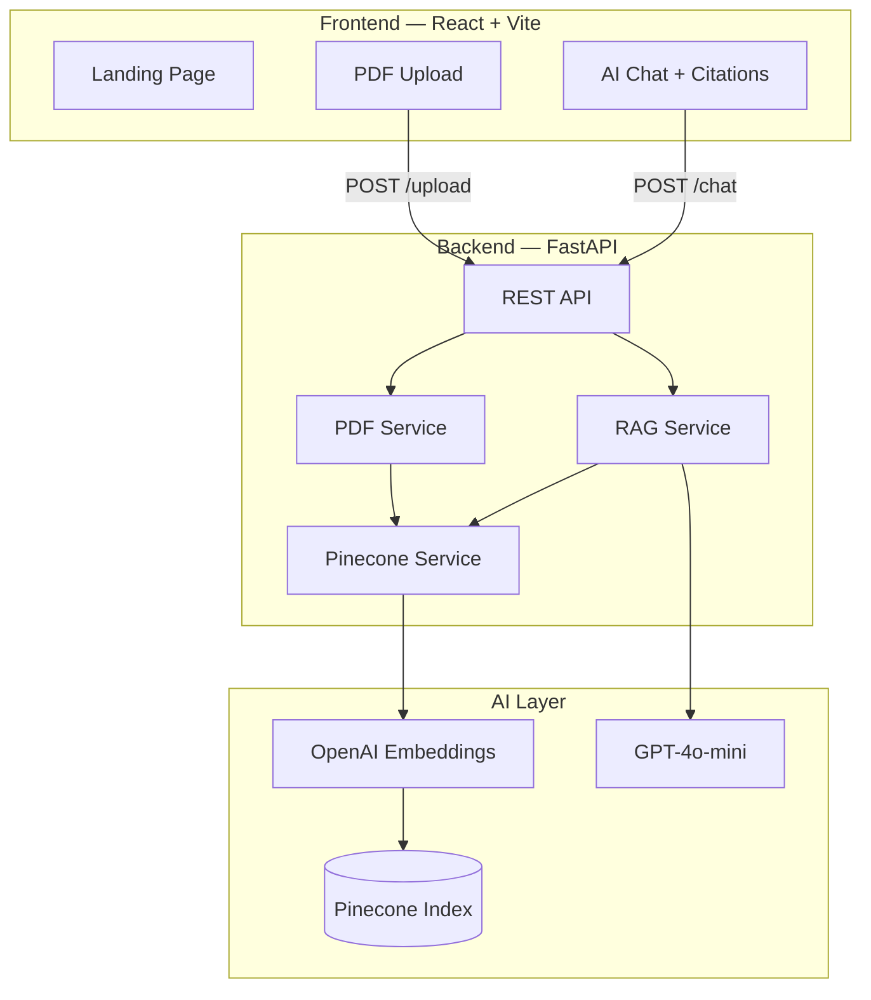

# FinSight AI

### Enterprise-Grade RAG Platform for Financial Document Intelligence

[](https://react.dev)
[](https://fastapi.tiangolo.com)
[](https://langchain.com)
[](https://openai.com)
[](https://pinecone.io)

**Live Demo:** Deploy frontend on [Vercel](https://vercel.com) · Backend on [Render](https://render.com)

> **Upload/Chat not working?** See **[DEPLOYMENT.md](./DEPLOYMENT.md)** — step-by-step setup for API keys, Render backend, and Vercel env vars.

**Repository:** [github.com/Yash5247/FinSight_AI](https://github.com/Yash5247/FinSight_AI)

---

## Overview

**FinSight AI** is a full-stack **Retrieval-Augmented Generation (RAG)** application that transforms static corporate annual reports into an interactive financial intelligence platform. Users upload PDF reports from companies like **TCS, Infosys, Reliance Industries, and HDFC Bank**, then ask natural language questions and receive **citation-backed answers** grounded in the source documents.

This project demonstrates end-to-end AI engineering — from document ingestion and vector search to production deployment — making it ideal for **portfolio showcases, technical interviews, and placement discussions**.

---

## Problem Statement

Financial analysts, investors, and students spend hours manually searching through 100+ page annual reports to find revenue figures, risk disclosures, dividend data, and management commentary. Generic LLM chatbots hallucinate numbers and cannot cite sources — making them unreliable for financial decision-making.

---

## Solution

FinSight AI implements a **production RAG pipeline** that:

1. **Extracts** text from uploaded PDF annual reports
2. **Chunks** documents with semantic-aware splitting
3. **Embeds** content using OpenAI `text-embedding-3-small`
4. **Stores** vectors in Pinecone for fast similarity search
5. **Retrieves** the most relevant passages for each user query
6. **Generates** answers with GPT-4o-mini strictly grounded in retrieved context
7. **Cites** exact source pages and excerpts for every response

---

## Key Highlights (For Recruiters)

| Area | Implementation |
|------|----------------|
| **Frontend** | React 18, TypeScript, Vite, Framer Motion animations, responsive glassmorphism UI |
| **Backend** | FastAPI with modular service architecture, Pydantic validation, structured logging |
| **AI / ML** | LangChain RAG chain, OpenAI embeddings + chat, Pinecone vector database |
| **DevOps** | Docker, docker-compose, Render blueprint, Vercel deployment config |
| **Best Practices** | Type hints, error handling, CORS, environment-based config, API documentation |

---

## Architecture



---

## Features

- **Smart PDF Ingestion** — Drag-and-drop upload with company auto-detection
- **Vector Indexing** — Automatic chunking, embedding, and Pinecone storage
- **Natural Language Q&A** — Ask about revenue, margins, risks, dividends, CEO messages
- **Source Citations** — Page-level excerpts with similarity scores
- **Document Scoping** — Search across all reports or filter to a single document
- **Production Ready** — Dockerized, deployable, with health checks and error handling

---

## Tech Stack

| Layer | Technologies |
|-------|-------------|
| Frontend | React 18, TypeScript, Vite, Framer Motion, Lucide Icons, React Router |
| Backend | Python 3.11, FastAPI, Uvicorn, Pydantic Settings |
| AI | LangChain, LangChain-OpenAI, LangChain-Pinecone, OpenAI API |
| Vector DB | Pinecone (Serverless) |
| PDF | PyPDF |
| Deployment | Docker, Vercel (frontend), Render (backend) |

---

## Project Structure

```
FinSight/
├── frontend/          # React SPA — landing, upload, chat
│   ├── src/
│   │   ├── components/    # Pages + UI components
│   │   ├── api/           # HTTP client
│   │   └── context/       # Document state
│   ├── Dockerfile
│   └── vercel.json
├── backend/           # FastAPI RAG backend
│   ├── app/
│   │   ├── routes/        # /health, /upload, /chat
│   │   ├── services/      # PDF, embedding, Pinecone, RAG
│   │   ├── models/        # Pydantic schemas
│   │   └── core/          # Exceptions
│   ├── Dockerfile
│   └── render.yaml
└── README.md
```

---

## API Endpoints

| Method | Endpoint | Description |
|--------|----------|-------------|
| `GET` | `/health` | Service health check |
| `POST` | `/upload` | Upload PDF, index in Pinecone |
| `POST` | `/chat` | Ask question, get cited answer |

Interactive docs: `http://localhost:8000/docs`

---

## Quick Start

### Backend

```bash
cd backend
python -m venv venv
venv\Scripts\activate        # Windows
pip install -r requirements.txt
copy .env.example .env       # Add OPENAI_API_KEY, PINECONE_API_KEY
python run.py
```

### Frontend

```bash
cd frontend
npm install
copy .env.example .env         # VITE_API_URL=http://localhost:8000
npm run dev
```

Open **http://localhost:5173**

---

## Deployment

### Frontend → Vercel

1. Import [FinSight_AI](https://github.com/Yash5247/FinSight_AI) on Vercel
2. Set **Root Directory** to `frontend`
3. Add env: `VITE_API_URL=https://your-backend.onrender.com`
4. Deploy

### Backend → Render

1. Create Web Service from GitHub repo
2. Set **Root Directory** to `backend`
3. Add env vars from `backend/.env.example`
4. Set `CORS_ORIGINS` to your Vercel URL
5. Deploy

---

## Environment Variables

**Backend:** `OPENAI_API_KEY`, `PINECONE_API_KEY`, `PINECONE_INDEX_NAME`, `CORS_ORIGINS`

**Frontend:** `VITE_API_URL`

See `backend/.env.example` and `frontend/.env.example` for full list.

---

## Author

**Yash** — Full-Stack AI Engineer

Built as a portfolio project demonstrating RAG architecture, modern React UI, and cloud-native deployment.

---

## License

MIT
